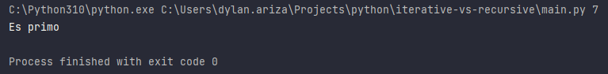
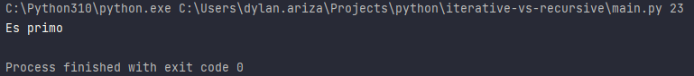
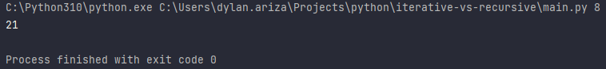
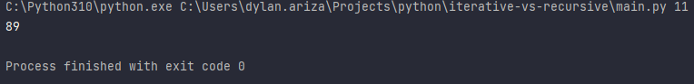

# Algoritmos recursivos e iterativos

Se genera el siguiente escenario de prueba con el fin de poder identificar cual es el enfoque que se requiere al optar por un esquema iterativo o recursivo

## Algoritmos

### Numero primo

Se requiere validar si un número es primo o no

#### Implementación

Iterativo
```python
class Iterative:
    @staticmethod
    def is_prime(num):
        if (num < 1):
            return False
        for i in range(2, num):
            if (num % i == 0):
                return False
        return True
```

Recursivo
```python
class Recursive:
    @staticmethod
    def is_prime(num, n = 2):
        if (n == num):
            return True
        return False if (num % n == 0) else Recursive.is_prime(num, n + 1)
```

#### Ejecución

Iterativo
```python
if __name__ == "__main__":
    print("Es primo") if Iterative.is_prime(int(sys.argv[1])) else print("No es primo")
```


Recursivo
```python
if __name__ == "__main__":
    print("Es primo") if Recursive.is_prime(int(sys.argv[1])) else print("No es primo")
```


### Fibonacci

Desde un programa, simular la secuencia fibonacci

#### Implementación

Iterativo
```python
class Iterative:
    @staticmethod
    def fibonacci(n):
        a, b = 0, 1
        for i in range(n - 1):
            a, b = b, b + a
        return b
```

Recursivo
```python
class Recursive:
    @staticmethod
    def fibonacci(n):
        if n == 0:
            return 0
        elif n == 1:
            return 1
        else:
            return Recursive.fibonacci(n - 1) + Recursive.fibonacci(n - 2)
```

#### Ejecución

Iterativo
```python
if __name__ == "__main__":
    print(Iterative.fibonacci(int(sys.argv[1])))
```


Recursivo
```python
if __name__ == "__main__":
    print(Recursive.fibonacci(int(sys.argv[1])))
```
